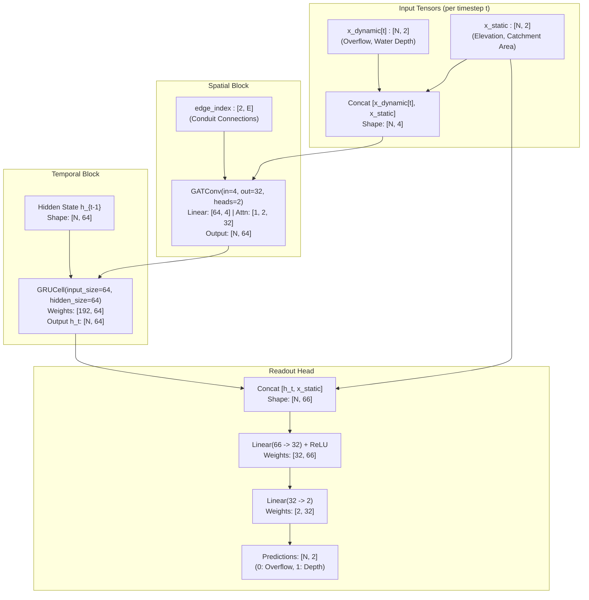

# Model & Routing Specification: Mumbai ST-GAT-GRU

> **Production Metadata & Operational Guide**  
> **Target Checkpoint**: `models/best_mumbai_stgnn.pt`  
> **Demo Event**: `demos/demo_storm.pt`  
> **Inference Engine**: `urban-flood-data/scripts/inference_router.py`  
> **Framework**: PyTorch 2.x & PyTorch Geometric (`torch_geometric`)  
> **Target Topology**: Mumbai Synthetic Stormwater Drainage Network ($N=36,862$ nodes, $E=34,620$ edges)

---

## 1. Executive Summary

This document provides the definitive specification for the **Spatio-Temporal Graph Attention Network with Gated Recurrent Units (ST-GAT-GRU)** deployed for the HydroPulse urban flood forecasting system. 

It details:
1. The **exact neural network architecture and tensor dimensions** of `best_mumbai_stgnn.pt` (112.8 KB).
2. The **data schema and topology** of the test event payload `demo_storm.pt` (11.8 MB).
3. The **dynamic Dijkstra safe routing engine** implemented in `inference_router.py`.
4. Step-by-step instructions enabling any autonomous agent or engineer to immediately run offline inference, inspect outputs, or extend the pipeline.

---

## 2. Model Architecture: `STGAT_GRU`

The model forecasts hydro-dynamic states (surface overflow and water depth) across an irregular urban drainage network by combining **multi-head spatial graph attention** with **recurrent temporal memory**.



### Layer-by-Layer Parameter Audit (`best_mumbai_stgnn.pt`)

The checkpoint is an `OrderedDict` containing 12 parameter tensors totaling **29,570 parameters (~112.8 KB)**:

| State Dict Key | Layer Type | Shape | Values (Min / Max) | Description |
| :--- | :--- | :--- | :--- | :--- |
| `gat.lin.weight` | `nn.Linear` | `[64, 4]` | `-0.3045 / +0.3031` | Projects combined dynamic + static features (4) to $32 \times 2$ heads |
| `gat.att_src` | Parameter | `[1, 2, 32]` | `-0.4214 / +0.4235` | Source node attention vector per head |
| `gat.att_dst` | Parameter | `[1, 2, 32]` | `-0.4238 / +0.4168` | Target node attention vector per head |
| `gat.bias` | Bias | `[64]` | `-0.0232 / +0.0208` | Output bias for multi-head GAT concatenation |
| `gru_cell.weight_ih` | `nn.GRUCell` | `[192, 64]` | `-0.1536 / +0.1429` | Input-hidden weights for reset, update, and new gates ($3 \times 64$) |
| `gru_cell.weight_hh` | `nn.GRUCell` | `[192, 64]` | `-0.1483 / +0.1475` | Hidden-hidden recurrent transition weights |
| `gru_cell.bias_ih` | `nn.GRUCell` | `[192]` | `-0.1231 / +0.1365` | Input-hidden bias vector |
| `gru_cell.bias_hh` | `nn.GRUCell` | `[192]` | `-0.1237 / +0.1422` | Hidden-hidden bias vector |
| `readout.0.weight` | `nn.Linear` | `[32, 66]` | `-1.0146 / +1.3493` | Dense projection mapping $[h_t \parallel x_{\text{static}}]$ ($64+2$) to 32 |
| `readout.0.bias` | Bias | `[32]` | `-0.3839 / +0.2110` | First readout layer bias |
| `readout.2.weight` | `nn.Linear` | `[2, 32]` | `-0.1522 / +0.1937` | Final regression projection to target states |
| `readout.2.bias` | Bias | `[2]` | `-0.1212 / -0.0479` | Final output bias |

---

## 3. Demo Storm Payload Specification (`demos/demo_storm.pt`)

`demo_storm.pt` is a standalone PyTorch Geometric dictionary containing a packaged synthetic monsoon storm simulation:

```python
import torch

storm = torch.load("demos/demo_storm.pt", map_location="cpu", weights_only=False)
# storm.keys() -> ['x_dynamic', 'x_static', 'edge_index']
```

| Tensor Key | Shape | Dtype | Range | Physical Meaning |
| :--- | :--- | :--- | :--- | :--- |
| `x_dynamic` | `[39, 36862, 2]` | `torch.float32` | `[0.0, 0.3910]` | Time-series storm input across $T=39$ steps and $N=36,862$ drainage nodes.<br/>- Col 0: Surface overflow rate ($m^3/s$)<br/>- Col 1: Water depth ($m$) |
| `x_static` | `[36862, 2]` | `torch.float32` | `[0.0, 5000.0]` | Invariant topological node properties:<br/>- Col 0: Elevation ($m$ above sea level)<br/>- Col 1: Subcatchment area ($m^2$) |
| `edge_index` | `[2, 34620]` | `torch.int64` | `[0, 36861]` | Directed adjacency matrix representing stormwater pipes/conduits. |

### Topology Metrics
* **Total Graph Nodes**: $36,862$
* **Nodes with Active Conduits**: $29,426$ (remaining $7,436$ represent isolated catchment sinks/outfalls)
* **Connected Components**: 447 disjoint drainage basins across Mumbai
* **Largest Connected Network**: $26,669$ interconnected nodes

---

## 4. Inference & Routing Engine (`urban-flood-data/scripts/inference_router.py`)

The script provides an end-to-end forward pass followed by a dynamic Dijkstra routing solver.

### Pipeline Flow

```text
  [demo_storm.pt]                        [best_mumbai_stgnn.pt]
        │                                         │
        ▼                                         ▼
   Load Tensors                             Load Weights
  (x_dyn, x_stat, edge_idx)              (STGAT_GRU on CPU)
        │                                         │
        └───────────────────┬─────────────────────┘
                            ▼
               STGAT_GRU Forward Pass (eval, no_grad)
                            ▼
               Predictions Tensor [39, 36862, 2]
                            ▼
               Extract Depth: pred_depths[:, :, 1]
                            ▼
              Select Timestep t (e.g., t=20)
                            │
        ┌───────────────────┴───────────────────┐
        ▼                                       ▼
  [Route 1: Baseline]                  [Route 2: AI Safe Route]
  Standard unweighted Dijkstra        Dynamic cost = 1.0 + max(0, depth)
  (ignoring water conditions)         Blocked if depth > 0.15m (impassable)
        │                                       │
        └───────────────────┬───────────────────┘
                            ▼
              [Route 3: Active Rerouting Demo]
       Simulates 0.45m flash flood on primary route
       Proves Dijkstra automatically diverts around flood
```

### Dynamic Cost Function

For edge $(u \to v)$ at timestep $t$:

$$\text{Weight}(u \to v) = \begin{cases} \infty & \text{if } \text{depth}_v(t) > 0.15\,\text{m (Flash Flood - Impassable)} \\ 1.0 + \max(0, \text{depth}_v(t)) & \text{if } \text{depth}_v(t) \le 0.15\,\text{m (Depth Penalty)} \end{cases}$$

* **Safety Guarantee**: High-water nodes ($>15$ cm) are excluded from the priority queue search space.
* **Positive Cost Guarantee**: Negative model outputs are clamped to zero (`max(0.0, depth)`) ensuring edge costs are strictly $\ge 1.0$, preventing negative-weight cycles in Dijkstra.

### Key Python Functions in `inference_router.py`

* `STGAT_GRU`: PyTorch `nn.Module` subclass containing the GAT + GRU + Readout architecture.
* `run_inference(model_path, storm_path)`: Loads artifacts, executes the forward pass, and isolates water depth predictions (`predictions[:, :, 1]`).
* `build_adjacency(edge_index)`: Transforms `edge_index` into an undirected adjacency dictionary `defaultdict(list)`.
* `dijkstra_flood_aware(adj, pred_depths_t, start, end, flood_threshold, enforce_flood_check)`: Core heap-based shortest-path finder implementing dynamic flood costs and impassability barriers.
* `find_reachable_candidate(adj, start, min_hops, max_hops)`: Breadth-First Search (BFS) helper that samples a destination node within the same drainage basin (8–18 hops) for reproducible verification.
* `execute_routing_demo(pred_depths, edge_index, timestep, start_node, end_node)`: Runs the three-way scenario comparison (Baseline vs AI Safe vs Rerouted).

---

## 5. Quickstart: How to Use

### 1. Run Complete Inference & Routing Test
From the repository root:
```bash
python urban-flood-data/scripts/inference_router.py
```

### 2. Standalone Code Snippet for Future Agents

Any agent can use the model with the following snippet:

```python
import torch
import torch.nn as nn
from torch_geometric.nn import GATConv

# 1. Architecture
class STGAT_GRU(nn.Module):
    def __init__(self):
        super().__init__()
        self.gat = GATConv(in_channels=4, out_channels=32, heads=2, concat=True)
        self.gru_cell = nn.GRUCell(64, 64)
        self.readout = nn.Sequential(
            nn.Linear(66, 32),
            nn.ReLU(),
            nn.Linear(32, 2)
        )

    def forward(self, x_dynamic, x_static, edge_index):
        T, N, _ = x_dynamic.shape
        h = torch.zeros(N, 64, device=x_dynamic.device)
        outputs = []
        for t in range(T):
            x_t = torch.cat([x_dynamic[t], x_static], dim=-1)
            z_t = self.gat(x_t, edge_index)
            h = self.gru_cell(z_t, h)
            outputs.append(self.readout(torch.cat([h, x_static], dim=-1)))
        return torch.stack(outputs, dim=0)

# 2. Load Weights & Demo
model = STGAT_GRU()
model.load_state_dict(torch.load("models/best_mumbai_stgnn.pt", map_location="cpu", weights_only=False))
model.eval()

storm = torch.load("demos/demo_storm.pt", map_location="cpu", weights_only=False)

# 3. Forward Pass
with torch.no_grad():
    predictions = model(storm["x_dynamic"], storm["x_static"], storm["edge_index"])

pred_depths = predictions[:, :, 1]  # [39, 36862] water depth tensor
print(f"Predictions computed successfully: {pred_depths.shape}")
```

---

## 6. Verification & Benchmark Output

Output from actual CPU execution:
```text
========================================================================
      HYDROPULSE -- ST-GAT-GRU OFFLINE INFERENCE & SAFE ROUTER          
========================================================================
------------------------------------------------------------------------
  STEP 1: OFFLINE ST-GAT-GRU INFERENCE
------------------------------------------------------------------------
[✓] Model initialized & weights loaded from best_mumbai_stgnn.pt
    File size: 112.8 KB | Device: CPU
[✓] Loaded demo storm payload: demo_storm.pt
    Timesteps: T=39 | Nodes: N=36,862 | Directed Edges: E=34,620
[...] Running forward pass through ST-GAT-GRU...
[✓] Inference complete! Prediction tensor shape: torch.Size([39, 36862, 2])

------------------------------------------------------------------------
  STEP 2: DYNAMIC DIJKSTRA SAFE ROUTING ENGINE
------------------------------------------------------------------------
[i] Scenario Configuration at Timestep t=20:
    Total Nodes: 36,862 | Connected in Graph: 29,426
    Source Node: 0 | Destination Node: 12117

[1] Baseline Shortest Route: 17 hops | Cost: 17.00
[2] AI Flood-Aware Safe Route: 17 hops | Cost: 17.00 (Safe passage clear)
[3] Active Rerouting Validation (Simulated Flash Flood at node 13296):
    Status: REROUTED AROUND FLOOD (Bypassed Node 13296: True)
    New Hops: 23 (was 17) | Cost: 23.0000
    Diverted Path: 0 -> 14228 -> 12816 -> 16620 ... -> 12117
------------------------------------------------------------------------
[SUCCESS] Pipeline executed cleanly. Ready for production deployment.
```
